# 권채린 · 조영민 모바일 청첩장

소중한 분들을 결혼식에 모시기 위해 준비한 모바일 청첩장입니다. 같은 초대장을 두 가지 분위기로 볼 수 있도록, 사진과 여백이 중심이 되는 모던 모드와 픽셀아트 감성의 게임 모드를 함께 담았습니다.

[청첩장 바로가기](https://sillytoolvalley.github.io/Wedding-Invitation/)

## 모드 안내

모던 모드는 예식 정보를 차분하고 편안하게 확인하는 기본 화면입니다. 사진, 일정, 장소, 방명록, 참석 의사 전달까지 청첩장에 필요한 내용을 단정한 흐름으로 보여줍니다.

게임 모드는 청첩장 전체가 레트로 게임 화면처럼 바뀌는 또 하나의 분위기입니다. 같은 안내 내용을 스테이지, 맵, 메시지, 아이템 같은 게임식 표현으로 볼 수 있고, 마지막에는 직접 즐길 수 있는 미니게임이 따로 준비되어 있습니다.

## 섹션별 화면 비교

### 첫 화면

| 모던 모드 | 게임 모드 |
| --- | --- |
| 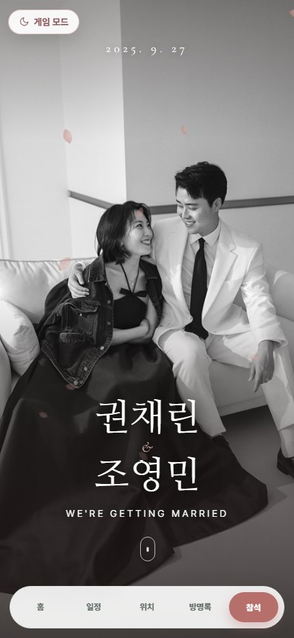 | 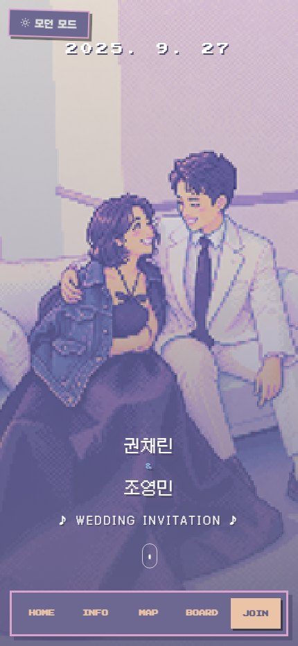 |

모던 모드는 두 사람의 사진과 이름을 크게 보여주고, 게임 모드는 같은 첫인상을 픽셀아트 색감과 게임 UI로 바꿔 보여줍니다.

### 초대글

| 모던 모드 | 게임 모드 |
| --- | --- |
| 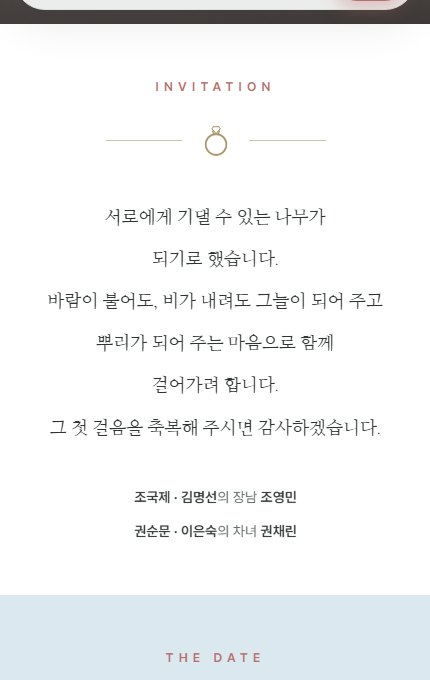 | 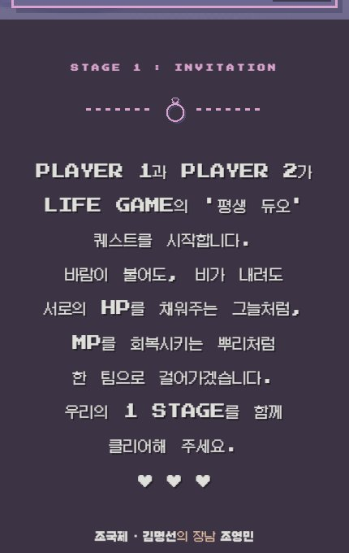 |

초대의 마음은 같은 내용으로 전하되, 모던 모드는 편지처럼 조용하게, 게임 모드는 첫 스테이지 안내처럼 경쾌하게 표현됩니다.

### 예식 일정

| 모던 모드 | 게임 모드 |
| --- | --- |
| 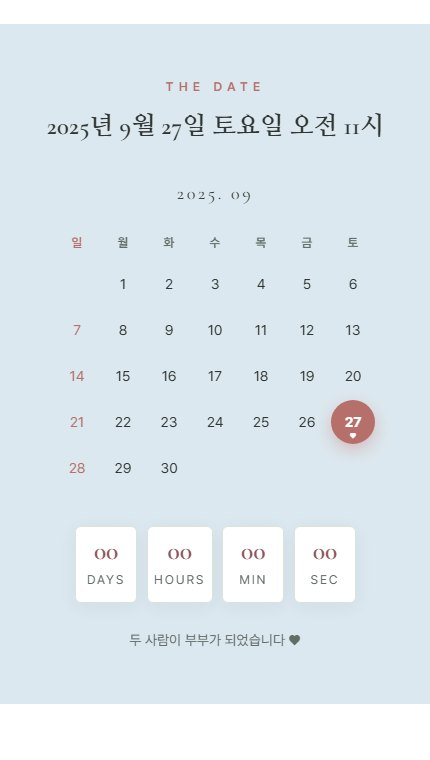 | 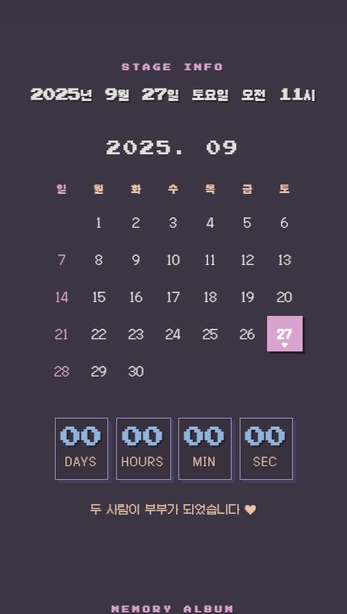 |

날짜와 시간은 달력과 카운트다운으로 확인할 수 있습니다. 게임 모드에서는 정보 화면도 레트로 게임의 스테이지 정보처럼 보이도록 바뀝니다.

### 사진첩

| 모던 모드 | 게임 모드 |
| --- | --- |
| 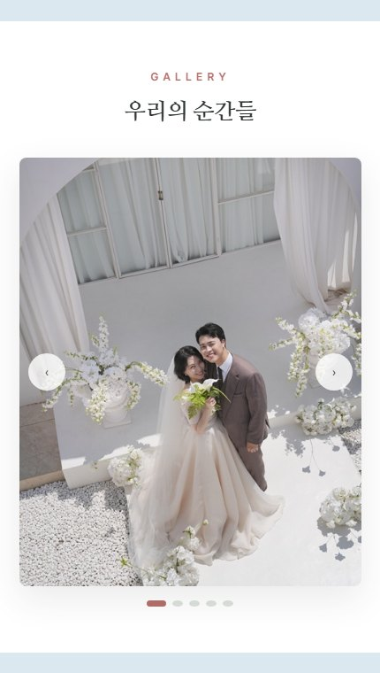 | 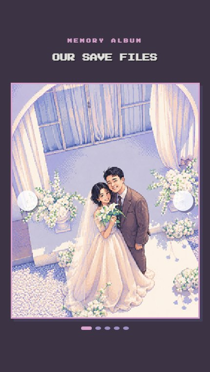 |

두 사람의 사진은 모던 모드에서는 깨끗한 갤러리로, 게임 모드에서는 세이브 파일을 넘겨보는 듯한 화면으로 담았습니다.

### 오시는 길

| 모던 모드 | 게임 모드 |
| --- | --- |
| 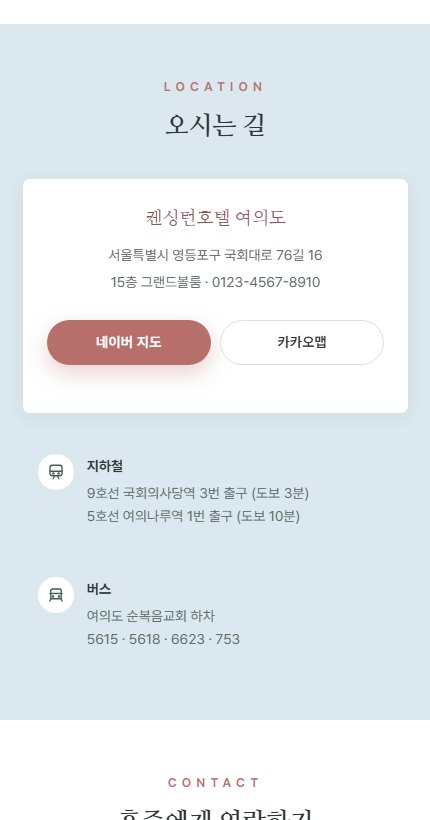 | 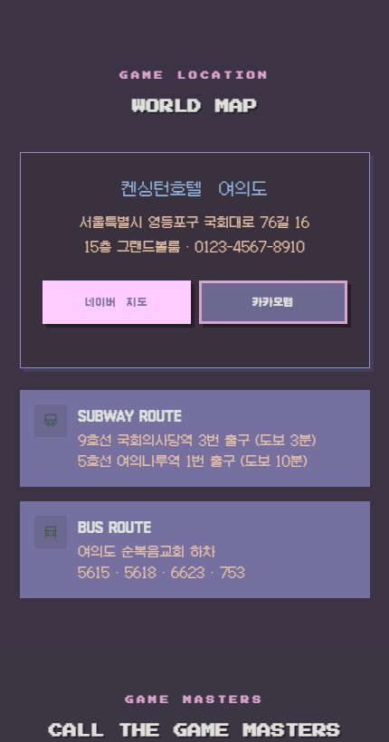 |

예식장 주소와 교통 안내는 두 모드 모두 바로 확인할 수 있습니다. 게임 모드에서는 장소 안내가 월드맵을 여는 느낌으로 바뀝니다.

### 혼주 연락

| 모던 모드 | 게임 모드 |
| --- | --- |
| 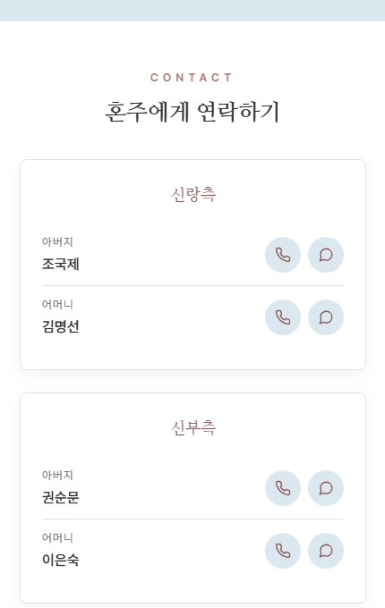 | 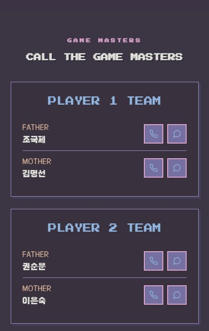 |

혼주 연락처는 필요한 순간 빠르게 볼 수 있도록 정리했습니다. 게임 모드에서는 게임 속 안내 카드처럼 조금 더 장난스럽게 표현됩니다.

### 참석 의사

| 모던 모드 | 게임 모드 |
| --- | --- |
| 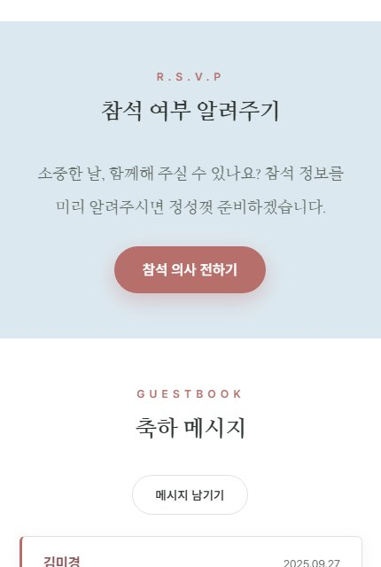 | 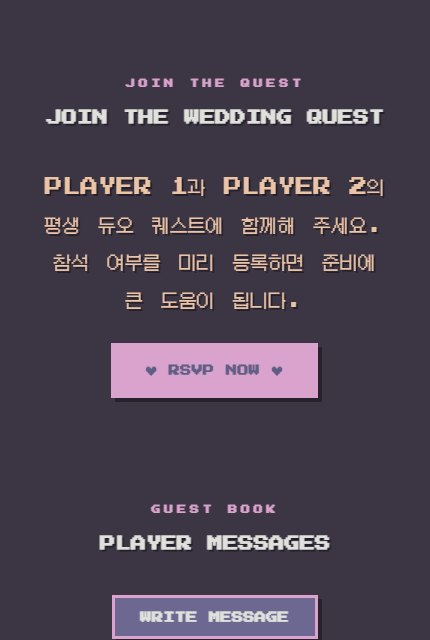 |

참석 의사는 버튼을 통해 전달할 수 있습니다. 모던 모드는 정중한 초대의 흐름을 유지하고, 게임 모드는 함께 퀘스트에 참여하는 분위기로 안내합니다.

### 축하 메시지

| 모던 모드 | 게임 모드 |
| --- | --- |
| 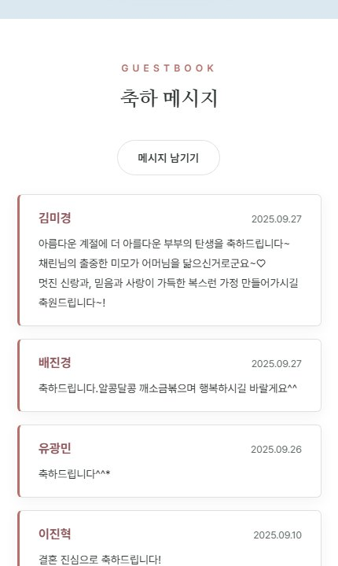 | 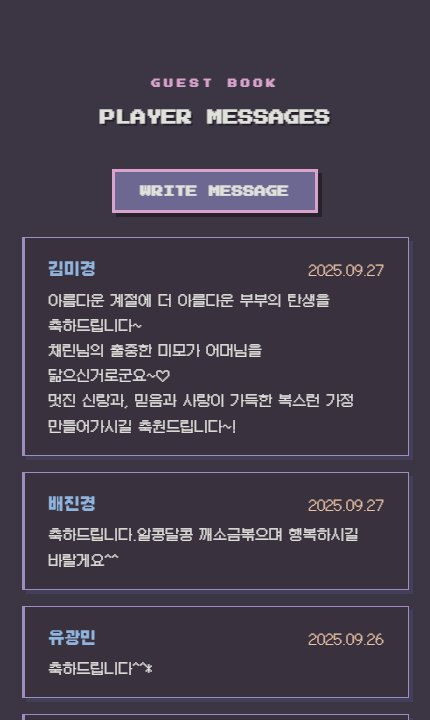 |

방명록에는 축하 메시지를 남길 수 있습니다. 두 모드 모두 마음을 전하는 기능은 같고, 화면의 말투와 분위기만 다르게 구성했습니다.

### 마음 전하기

| 모던 모드 | 게임 모드 |
| --- | --- |
| 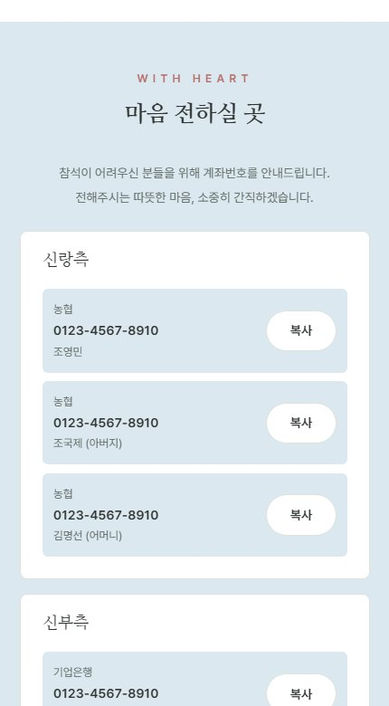 | 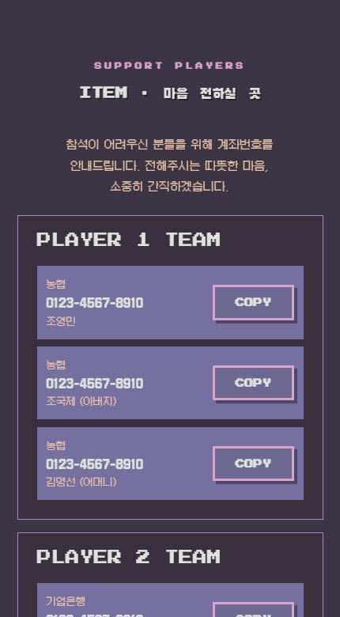 |

마음을 전하실 곳은 조심스럽게 접어 둔 안내로 담았습니다. 게임 모드에서는 아이템 안내처럼 보이도록 전체 톤을 맞췄습니다.

### 공유와 마무리

| 모던 모드 | 게임 모드 |
| --- | --- |
| 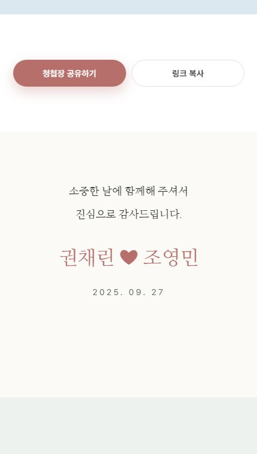 | 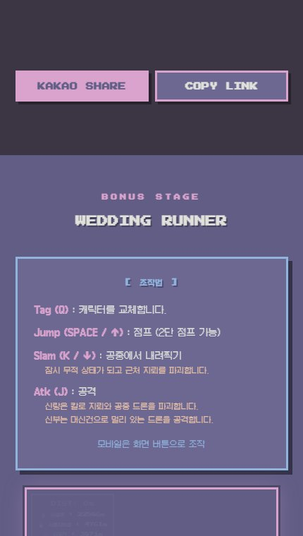 |

청첩장은 링크로 공유할 수 있고, 마지막에는 두 사람이 전하고 싶은 인사로 마무리됩니다.

## 게임 모드 보너스 스테이지

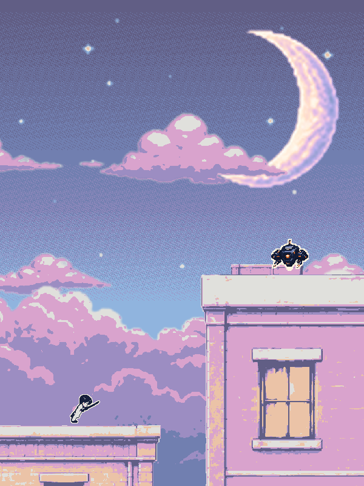

게임 모드에는 청첩장 화면과 별도로 즐길 수 있는 픽셀 러닝 게임이 들어 있습니다. 신랑과 신부 캐릭터가 함께 달리고, 점프와 공격으로 장애물을 넘으며 결혼식으로 향하는 작은 보너스 스테이지입니다.

## 청첩장에 담긴 것

- 결혼식 날짜, 시간, 장소 안내
- 두 사람의 사진과 초대의 글
- 오시는 길과 교통 안내
- 혼주 연락처
- 참석 의사 전달
- 축하 메시지 방명록
- 마음 전하기 안내
- 청첩장 공유
- 모던 모드와 게임 모드 전환
- 게임 모드 전용 미니게임

함께해 주시는 모든 분들께 감사한 마음을 전합니다.
